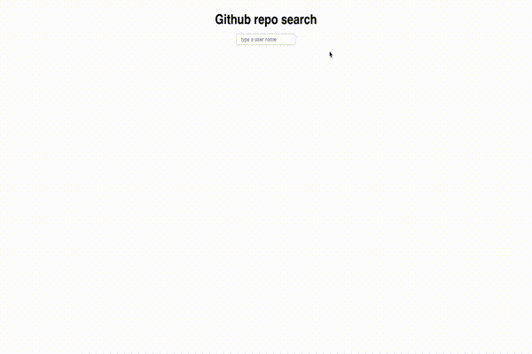
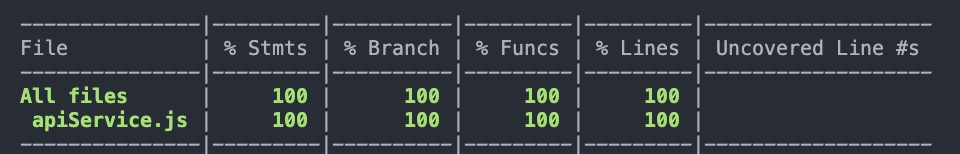

# GitHub Repository Search Field

This application allows to display a list of repositories with the username typed in search input box. 
## Demo 




## Optimazition 

### Debounce
This ```useDebounce()``` delays the process of the keyup event until the user has stopped typing for a preddetermned amount of time, 
which can reduces the number of API calls sent to your server. This is a commonly used technology in search input box. 


```js
useDebounce(term, loadUser, 500);
```

### StyledComponent
StyledComponent implements **CSS-in-JS**, which makes every single component more integrated. It is easier to debug or manage the project. 

```js
export default styled(SearchList)`
  ${InputField} {
    margin: 1rem 0;
  }
  ${UserRepos} {
    margin-top: 1rem;
    :first-child {
      margin-top: 0;
    }
  }
  padding: 2rem;
  max-width: 1024px;
  display: flex;
  flex-direction: column;
  justify-content: center;
  align-items: center;

  margin: 0 auto;

  .error-text {
    color: red;
  }
`;
```

## Problem with Auth

When I was working on this project, I found out there is a problem with rate limit. 
Then I tried to use my personal token. It works first, but the token is removed by Github after I commit.
I comment out the auth part in apiService.js file to indicate that my application works well using my token before commit. 
Here is the screenshot of my application.


```js
export const searchUser = (term) => {
  return axios.get(`${BASE_URL}/search/users`, {
    params: {
      q: term
    } /** ,
    auth: {
      username: "maydayenenen",
      password: "b9baf8255b93923392747fab763205931ce0d103"
    } */
  });
};

export const getReposByUser = (userName) => {
  return axios.get(`${BASE_URL}/users/${userName}/repos`/** , {
    auth: {
      username: "maydayenenen",
      password: "b9baf8255b93923392747fab763205931ce0d103"
    }
  } */);
};
```

## Testing
The test is implemented using **@testing-library**.
<br />
Total: 1 test suite and 6 test cases 
<br />
Coverage: 

<br />
I test if the UI is rendered properly by checking if the App, title, and input box is rendered correctly. 
Also I use the **setupServer** function from **msw** to mock an API request that our tested component makes.
I use **userEvent.type()** to mock the user input action, make sure it will display corresponding user and repo after user typed something in search field. 
Also, I test if the avatar of user, username, and the list of repo cards is rendered correctly
<br />
I am still learning and practicing Cypress. I will push my Cypress test if I have enough time before the position closed. 


